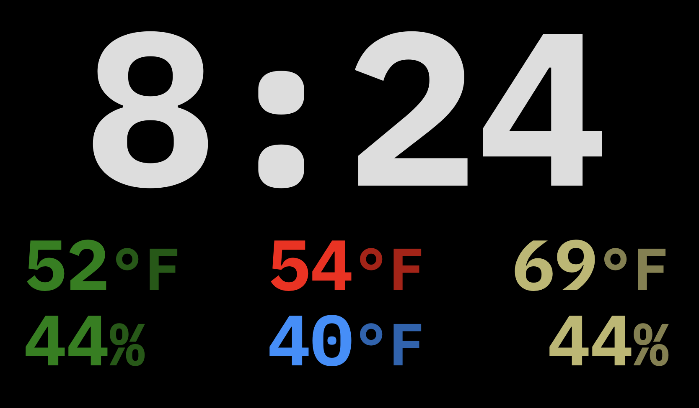

[](https://github.com/hacs/integration)

# Simple Weather Clock
A card for Home Assistant designed to display a digital clock with six slots below for various numeric environmental sensor data.  This card is meant to be used on a dashboard configured as a panel.



**Installation**  
You should install this card using [HACS](https://hacs.xyz).

**Options**

| Name | Type | Default | Description
| ---- | ---- | ------- | -----------
| type | string | **Required** | `custom:simple-weather-clock`
| clock | string | **Required** | sensor with the time
| topleft | string |  | sensor to show in top left slot
| topcenter | string |  | sensor to show in top center slot
| topright | string |  | sensor to show in top right slot
| bottomleft | string |  | sensor to show in bottom left slot
| bottomcenter | string |  | sensor to show in bottom center slot
| bottomright | string |  | sensor to show in bottom right slot
| background | string | #000000 | CSS color for background
| font | string | IBM Plex Mono | font to use (must be installed as a resource, otherwise generic serif font is used)
| fontweight | integer | 700 | CSS font-weight for clock and slots
| clockfontsize | integer | 260 | CSS font-size for clock
| infofontsize | integer | 85 | CSS font-size for info slots
| opacity | float | 0.7 | opacity for measurement display in the slots
| clockcolor | string | #dddddd | CSS color for clock digits (white-ish)
| topleftcolor | string | #008001 | CSS color for top left slot (green)
| topcentercolor | string | #fe0000 | CSS color for top center slot (red)
| toprightcolor | string | #bdb76b | CSS color for top center slot (soft yellow)
| bottomleftcolor | string | #008001 | CSS color for bottom left slot (green)
| bottomcentercolor | string | #1f90ff | CSS color for bottom center slot (soft blue)
| bottomrightcolor | string | #bdb76b | CSS color for bottom center slot (soft yellow)
| displaywidth | integer | 800 | width (in px) of display on which this will be displayed
| displayheight | integer | 480 | height (in px) of display on which this will be displayed
| viewportheight | integer or text | 100 | height of the black background; if no measurement is included, it's in vh, otherwise it's the measurement you include (px, etc)
| offset | integer | 0 | change vertical position of card (in px)
| clockspacing | integer | 0 | change space between clock and info slots (in px)
| infospacing | integer | 0 | change space between info rows (in px)
| infoedge | integer | 0 | change space between edge of display and edge of info slots (in px)

The defaults are set for a RaspberryPi 7" touch display.  The default colors assume the following:
- outdoor information in the left column
- forecast high in the middle upper slot
- forecast low in the middle lower slot
- indoor information in the right column

If you change the display width and height, you'll want to adjust the font sizes to fit.  The card will do some amount of automatic respacing based on font size, but you can also manually fine tune it as needed with the other options.

**Example**

```yaml
- type: custom:simple-weather-clock
  clock: sensor.normaltime
  topleft: sensor.temp_outdoor
  bottomleft: sensor.humidity_outdoor
  topcenter: sensor.openweathermap_forecast_temperature
  bottomcenter: sensor.openweathermap_forecast_temperature_low
  topright: sensor.temp_livingroom
  bottomright: sensor.humidity_livingroom
```

**Advaned Example**  
You can use something like the [config-template-card](https://github.com/iantrich/config-template-card) to have one clock card for multiple clocks showing slightly different information.

```yaml
type: custom:config-template-card
variables:
  currentUser: user.name
  whichSensor: |
    theuser => {
      if (theuser == 'Bedroom Clock') {
        return ['sensor.temp_bedroom', 'sensor.humidity_bedroom']
      }
      else if (theuser == 'Study Clock') {
        return ['sensor.temp_study', 'sensor.humidity_study']
      }
      return ['sensor.temp_livingroom', 'sensor.humidity_livingroom']
    }
entities:
  - sensor.normaltime
  - sensor.temp_outdoor
  - sensor.humidity_outdoor
  - sensor.openweathermap_forecast_temperature
  - sensor.openweathermap_forecast_temperature_low
  - ${ whichSensor(currentUser)[0] }
  - ${ whichSensor(currentUser)[1] }
card:
  type: custom:simple-weather-clock
  clock: sensor.normaltime
  topleft: sensor.temp_outdoor
  bottomleft: sensor.humidity_outdoor
  topcenter: sensor.openweathermap_forecast_temperature
  bottomcenter: sensor.openweathermap_forecast_temperature_low
  topright: ${ whichSensor(currentUser)[0] }
  bottomright: ${whichSensor(currentUser)[1] }
```